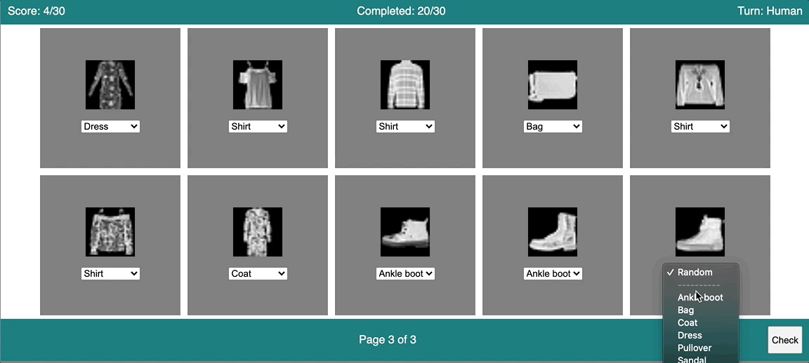
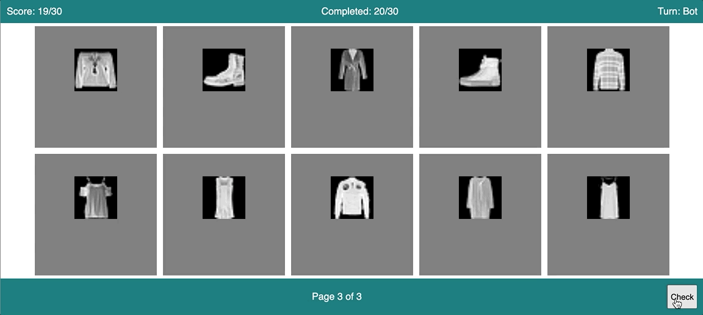

# Human Vs Bot in identifying Fashion images

Demo Link: <https://aungwaiyanhein21.github.io/fashion_captcha/web_app/>

## Flow

Human Turn

Bot Turn

## Summary

    A game where a player and a trained bot compete in classifying fashion images. 

    I use fashion mnist dataset (https://keras.io/api/datasets/fashion_mnist/). I use all training set for training the model. For the test set, I leave 100 images that will be used in web app for actually competing with human. 

## Why build it?

    For fun!

    I want to find out whether the machine learning model can help crack simple image captcha. 

<!-- ## Functionality

    

 -->

## Tech Stack
<ul>
    <li>HTML</li>
    <li>CSS</li>
    <li>JS</li>
    <li>Python (used for training the model and validating the model)
    </li>
</ul>

